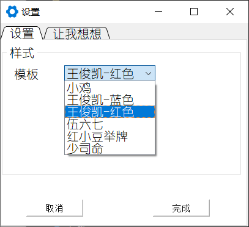
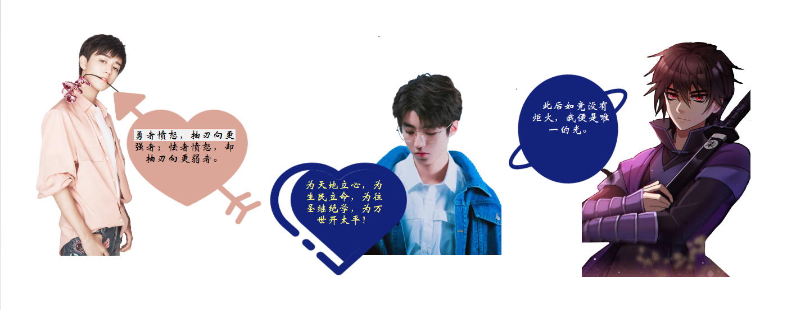
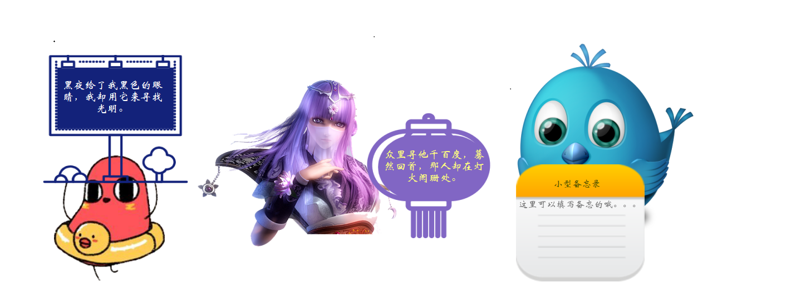

# 桌面标签
## 窗口介绍
### 控制主界面

### 子窗口
* 王俊凯，伍六七

* 少司命，红小豆

### 主要技术

---------
* 无边框，透明界面
* 右键菜单（置顶）
* 抠图，PS就不说了

### 视频示例
--------------------
* Bilibili
<iframe src="//player.bilibili.com/player.html?aid=243315047&bvid=BV1vv411z7vS&cid=195098855&page=1" scrolling="no" border="0" frameborder="no" framespacing="0" allowfullscreen="true"> </iframe>

<video 
    width="676" 
    height="514"
    id="video" 
    controls="" 
    preload="none"> 
    <source id="mp4" 
    src="//player.bilibili.com/player.html?aid=243315047&bvid=BV1vv411z7vS&cid=195098855&page=1" 
    type="video/mp4">
</video>

### 许可证
* Apache.(留个名字就行)
<b> <b/>

